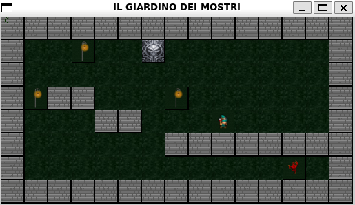
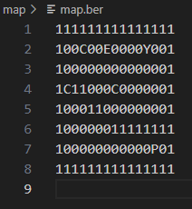
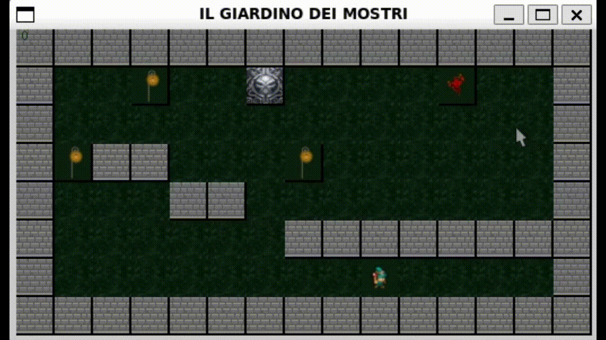

# So_Long (42 Firenze)

### Introduction

This project makes us use an MLX library, which allows us to recreate a 2D game with a map generator made up of char [Subject](./Docks/subject/so_long.subject.pdf).

MLX -> The MLX library (MiniLibX) is a lightweight graphics library in C, for creating windows, drawing shapes, handling input events (such as keyboard and mouse), and displaying images.




## Objective of the game

- dodge the enemy
- take all the collectibles
- go out the door



# Testing

Enter the folder where the makefile is and open the terminal.

To change the map ```./map/map.ber```

To exit the game ```Ctrl+c```

```bash
make
./so_long ./map/map.ber
```